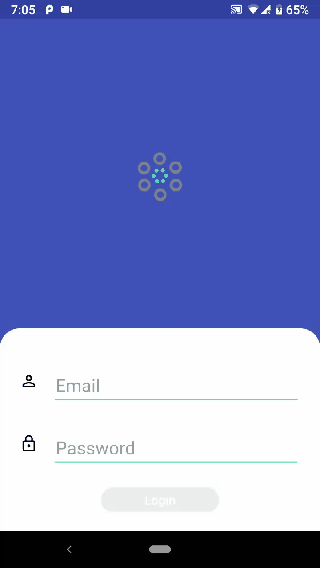

# android-kotlin-mvvm-architecture
This version of the app is called Login-MVVM
The sample aims to:

* Provide a basic [Model-View-ViewModel](https://en.wikipedia.org/wiki/Model–view–viewmodel) (MVVM) and Google Architecture Component using Live Data With Kotlin.
##

### What you need

Before exploring this sample, you might find it useful to familiarize yourself with the following topics:

* The [project README](README.md)
* Basic knowledge of Kotlin
* The [MVVM](https://en.wikipedia.org/wiki/Model–view–viewmodel) architecture
* The Android Architecture Components (https://developer.android.com/topic/libraries/architecture/)

The Login-MVVM sample uses the following dependencies:
* [Architecture Components](https://developer.android.com/topic/libraries/architecture/adding-components)
* [Retrofit](https://square.github.io/retrofit/)

### Designing the app

* ui - used to represnt user interface activity
* viewmodel - Used to manage logic actions
* model - used to represnt user model
* network - Used to manage network layer
